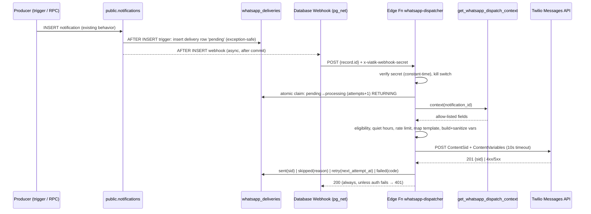

# Feature Spec: Global WhatsApp Notification Dispatcher (Twilio)

**Status:** Phase 1 implemented (2026-10-05) — see §15 for the decisions that override earlier sections.
**Owner:** Full-stack / platform
**Security review:** Required (new outbound PII channel, new security-definer RPC, new service-role Edge Function).

---

## 1. What & Why

Viatik already generates in-app notifications server-side (`public.notifications`, migrations 47, 50, 51, 56, 65, 70, 71). Travelers miss time-sensitive events (trip starts tomorrow, a vote is open, a payment was recorded) when they don't open the app. Today there is a single, ad-hoc WhatsApp sender (`app/actions/trip-notifications.ts` → `notifyTripStarted`) that:

- runs inside a Next.js Server Action (blocks the owner's request on Twilio latency);
- sends a **free-form `Body`**, which WhatsApp only allows inside a 24-hour customer-service window. Outside that window Twilio rejects it (error `63016`), so in practice most of these messages fail;
- has no consent/opt-in, no delivery log, no retry, and no idempotency.

This feature replaces that with a **single global dispatcher**: every eligible notification row inserted into `public.notifications` is delivered asynchronously over WhatsApp using **Meta-approved Content Templates**, to a phone number resolved **only** from trip traveler contact records, without ever affecting the core write path.

## 2. In Scope / Out of Scope

**In scope**

- Supabase Edge Function `whatsapp-dispatcher` triggered after `notifications` INSERT.
- A server-side template registry: `NotificationType` × locale → Twilio Content SID + variable builder.
- A security-definer, service-role-only "dispatch context" RPC that returns allow-listed fields only.
- A durable delivery log + recipient opt-in record (proposed future additive migration, described here, **not written**).
- Retry, backoff, quiet hours, rate limits, kill switch, redacted logging.
- Migrating `notifyTripStarted` onto the dispatcher.
- The exact list of templates to submit to Meta before launch.

**Out of scope**

- Inbound conversational WhatsApp (replying to the bot, chat flows).
- Marketing / promotional messages (different Meta category, different consent bar).
- SMS fallback.
- Notifications without a trip context (`friend_request`, account/settings changes) — see §5.4.
- Phone verification (OTP). Tracked separately in `.ai/specs/sms-verification.md`.
- Any change to the local-first client: the client never calls Twilio and never reads phone numbers for this feature.

## 3. Architecture Invariants (must hold)

1. **Local-first unchanged.** Dexie stays the client source of truth. The dispatcher is a pure server-side side effect of rows that already reached Supabase via existing triggers/RPCs. No UI component queries Supabase domain tables for this feature.
2. **Phone source = `trip_travelers` → `contacts` only.** `trip_travelers` has no phone column; the phone lives on the joined `contacts` row (`trip_travelers.contact_id → contacts.id`, `contacts.phone`). The dispatcher must **never** read `profiles.phone` (Migration 37: `profiles` is self-select only and its phone is private). Enforced by a static SQL test (§9).
3. **No phone persisted outside `contacts`.** The delivery log stores no phone number (optionally a salted hash for diagnostics). Logs show at most the last 2 digits.
4. **Core app isolation.** A Twilio outage, a bad template, or a dispatcher bug must never fail or roll back a `notifications` insert, a settlement, a vote, or a sync push.
5. **Money in minor units.** Amounts are read as `bigint` minor units and formatted to a display string at the edge using the currency exponent; no floating-point math.
6. **Templates only.** The dispatcher never sends a free-form `Body`. Every message uses `ContentSid` + `ContentVariables`.

## 4. Pillar 1 — The Meta Template Constraint

### 4.1 The constraint

WhatsApp Business messages that the business starts (anything we send without the user writing to us in the last 24 h) must use a **template pre-approved by Meta**. With Twilio, a template is a **Content Template** (SID `HX…`) created in Twilio Content Template Builder and submitted to Meta for WhatsApp approval. Sending looks like:

- `POST https://api.twilio.com/2010-04-01/Accounts/{AccountSid}/Messages.json`
- `To=whatsapp:+52…`, `MessagingServiceSid=MG…` (preferred over a raw `From`, enables sender pools and status callbacks)
- `ContentSid=HX…`
- `ContentVariables={"1":"Ana","2":"Cancún 2026","3":"$1,250.00 MXN"}` (JSON string; keys are positional placeholders)
- `StatusCallback=https://<project>.functions.supabase.co/whatsapp-status` (phase 2)

Consequences for the design:

- The free text in `notifications.message` **cannot** be sent as-is. Template wording is fixed; only the placeholders change.
- Each template is approved **per language**. Viatik ships EN and ES, so every template is submitted twice (`en`, `es`), and each language gets its own Content SID (or one multi-language Content resource, depending on how the Twilio account is set up — the registry supports both).
- Meta rejects or re-categorizes templates whose wording looks promotional. All Viatik templates must be strictly transactional (**UTILITY**).
- Variable rules (Meta): a variable cannot be empty; no newlines, tabs, or more than 4 consecutive spaces; avoid starting/ending the body with a variable or placing two variables side by side; provide realistic sample values at submission; the total body stays under 1024 characters.

### 4.2 Template registry (mapping dictionary)

A typed, code-reviewed registry lives in the Edge Function's shared module (proposed path `supabase/functions/_shared/whatsapp-templates.ts`, pure TypeScript with no Deno APIs so Vitest can test it). It maps each `NotificationType` to its template metadata. **SIDs are not hard-coded**; they're injected per environment from a Supabase secret (`WHATSAPP_TEMPLATE_SIDS`, a JSON object keyed by `templateKey.locale`) so staging and production use different approved templates without code changes.

Illustrative shape (design sketch, not implementation):

```ts
type TemplateKey =
  | "trip_reminder" | "trip_started" | "trip_added" | "trip_invitation"
  | "vote_needed" | "payment_recorded" | "payment_due" | "itinerary_updated"
  | "optin_confirmation";

interface TemplateDefinition {
  templateKey: TemplateKey;
  metaCategory: "UTILITY";
  /** Ordered placeholder names; index i becomes ContentVariables[String(i + 1)]. */
  variables: readonly ("recipientFirstName" | "tripName" | "tripStartDate" | "actorFirstName"
    | "activityTitle" | "amount" | "changeSummary")[];
  /** Optional dynamic URL-button suffix, e.g. "trips/<tripId>". */
  deepLink?: "trip" | "trip_votes" | "trip_expenses";
  enabled: boolean;
}

const WHATSAPP_TEMPLATES: Partial<Record<NotificationType, TemplateDefinition>> = {
  trip_alert:          { templateKey: "trip_reminder",    variables: ["recipientFirstName", "tripName", "tripStartDate"], deepLink: "trip", ... },
  trip_added:          { templateKey: "trip_added",       variables: ["recipientFirstName", "tripName"],                 deepLink: "trip", ... },
  trip_invitation:     { templateKey: "trip_invitation",  variables: ["actorFirstName", "tripName"],                     deepLink: "trip", ... },
  vote_pending:        { templateKey: "vote_needed",      variables: ["tripName", "activityTitle"],                      deepLink: "trip_votes", ... },
  settlement_recorded: { templateKey: "payment_recorded", variables: ["actorFirstName", "amount", "tripName"],            deepLink: "trip_expenses", ... },
  settlement_pending:  { templateKey: "payment_due",      variables: ["amount", "actorFirstName", "tripName"],            deepLink: "trip_expenses", enabled: false },
  // itinerary_updated: future enum value (see §4.4)
  // friend_request: intentionally absent (no trip context, see §5.4)
};
```

A type that isn't in the registry, or is marked `enabled: false`, is recorded as `skipped` with `skip_reason = 'type_not_enabled'`. It is never an error.

### 4.3 Extracting dynamic variables

**Rule: variables are resolved from the referenced domain rows on the server, never parsed from `notifications.message`.** The message column is free text written by several triggers in different formats. Examples: plain English strings ("You owe Ana 125000 MXN"), JSON for `settlement_recorded`, and sentinels like `__payer__`. Parsing it would be fragile and would let user-controlled text reach a template.

The dispatch-context RPC (§5.3) resolves, per type:

| Notification type | `reference_id` points to | Trip context | Variables resolved |
|---|---|---|---|
| `trip_alert` | `trips.id` | the trip | trip name, start date (formatted in `trips.time_zone`), recipient first name |
| `trip_added` | `trips.id` | the trip | trip name, recipient first name |
| `trip_invitation` | `trip_invitations.id` | `trip_invitations.trip_id` | inviter first name, trip name |
| `vote_pending` | `activities.id` | `activities.trip_id` | trip name, activity title |
| `settlement_recorded` | `expense_settlements.id` | `expense_settlements.trip_id` | payer first name, amount (minor units) + currency, trip name |
| `settlement_pending` | `expense_settlements.id` | `expense_settlements.trip_id` | (no current producer — see §4.4) |
| `friend_request` | `connections.id` | none | not dispatched |

Names: first names come from `profile_directory` / `get_profile_public_data` (public, Migration 37 compliant), never from `profiles` directly. The recipient's first name can also fall back to the contact's `full_name` on the matched traveler contact.

Sanitization (pure function, unit-tested):

- Strip control characters, newlines, and tabs; collapse whitespace; trim.
- Per-variable max length: names 40, trip name 60, activity title 60, change summary 80. Truncate with an ellipsis.
- Empty after sanitizing → localized default ("un viajero" / "a traveler", "tu viaje" / "your trip"). Meta rejects empty parameters.
- Amount: `formatMinorUnits(amount: bigint, currency)` using the ISO-4217 exponent (MXN/USD 2, JPY 0, …), string math on the `bigint`, then locale grouping. Never `Number(amount) / 100`.
- Dates: format `trips.start_date` (a date with no time) in the recipient's locale. Never shift it through UTC.

Locale: the recipient's `preferred_language` from `profile_directory` (`es` or `en`). Default `es`, because the primary market is Mexico. If the SID for that locale is missing, fall back to the other locale. If neither exists, skip with `template_missing`.

### 4.4 Gaps found in the current notification model

- **`itinerary_updated` does not exist.** The `notification_type` enum has `vote_pending, friend_request, settlement_pending, settlement_recorded, trip_alert, trip_invitation, trip_added`. Supporting it needs a future additive migration (new enum value plus a producer trigger on `activities`), and it **must** be throttled or digested (for example at most one per trip per recipient every 6 h), or a single editing session will spam every traveler.
- **`settlement_pending` has no producer.** Migrations 70/71 replaced the trigger function with `settlement_recorded`. The template stays `enabled: false` until a producer exists. (The original 47/51 producer also printed raw minor units — another reason to never forward `message`.)
- **`trip_started` does not exist** as a notification type. `notifyTripStarted` sends directly. To move it onto the dispatcher, add a `trip_started` enum value plus a producer (owner action or a daily `pg_cron` on `trips.start_date = current_date` in `trips.time_zone`).
- **`notifications` has no `trip_id` column.** The trip is derived from `reference_id` per type (table above). That keeps the schema unchanged, at the cost of one join per type inside the RPC.

## 5. Pillar 2 — Privacy & Data Architecture (Migration 37 compliance)

### 5.1 Data sources allowed / forbidden

| Source | Allowed? | Why |
|---|---|---|
| `contacts.phone` reached via `trip_travelers.contact_id` | ✅ only source | Mandated |
| `profiles.phone` | ❌ never | Private (Migration 37 self-select); unverified |
| `connections.*_snapshot` | ❌ | Snapshots intentionally carry no phone |
| `auth.users.phone` | ❌ | Not a contact record; not consented for this use |

### 5.2 Recipient phone resolution

For a notification addressed to `user_id = R` with derived trip `T`:

1. Candidate rows: `trip_travelers tt` where `tt.trip_id = T` and `tt.deleted_at is null`, joined to `contacts c` on `c.id = tt.contact_id`, `c.deleted_at is null`, **and `c.linked_profile_id = R`**. The link proves that this traveler record *is* the recipient (set by the email-match trigger from migration 13, or by an explicit link).
2. Deterministic preference when several contacts match (different editors may each have their own contact card for R):
   1. the contact owned by the **trip owner** (`c.owner_id = trips.owner_id`);
   2. otherwise the most recently updated contact.
   If the candidates hold **different** normalized numbers, skip with `ambiguous_phone`. Don't guess, because a wrong guess sends trip data to a stranger.
3. Validation: the chosen `contacts.phone` must already be a valid E.164 number (`^\+[1-9]\d{7,14}$` after stripping spaces, dashes, and parentheses). Otherwise skip with `phone_not_e164`.

**⚠️ Critical: do not infer `+1`.** The existing `toE164` in `lib/notifications/whatsapp.ts` turns a bare 10-digit number into `+1XXXXXXXXXX`. Viatik's core market is Mexico, where national mobile numbers are **also 10 digits** (for example `33 1234 5678`). Inferring `+1` would send Mexican travelers' trip and payment details to an unrelated US/Canada number. The dispatcher must therefore use a **strict** validator: only numbers stored with an explicit `+` country code, or a `00` international prefix, are sendable. The contact editor should later get a country-code picker and a hint ("Include country code, e.g. +52"). That's a UI follow-up, not part of this dispatcher.

### 5.3 Dispatch-context RPC (server-only)

Proposed `public.get_whatsapp_dispatch_context(p_notification_id uuid)`:

- `security definer`, `set search_path = public`, `revoke all … from public, anon, authenticated`, `grant execute … to service_role` only.
- Returns **one row of allow-listed fields**: `notification_id, recipient_user_id, type, locale, trip_id, trip_name, trip_time_zone, trip_start_date, activity_title, actor_first_name, amount_minor, currency, recipient_first_name, phone_e164_candidate, phone_conflict boolean, muted boolean, opted_in boolean, already_dispatched boolean`.
- Reads `profiles` only for `mute_trip_notifications` and `preferred_language` (same column-only precedent as the quiet-hours triggers in migrations 51/71). **It never selects `profiles.phone`**, and a static test enforces this.
- Contains every branching rule from §5.2, so phone selection is auditable in SQL and can't drift between callers.

### 5.4 Eligibility consequences (accepted)

- `friend_request` has no trip, so no `trip_travelers` record, so it is **not dispatched**.
- `trip_invitation` reaches only invitees who already exist as a linked traveler contact on that trip. Most invitees don't, so expect a low hit rate. That's acceptable under the phone rule.
- **Trip members who are not travelers** (members shown as "unrepresented" in the People panel) have no traveler contact and are skipped (`no_traveler_contact`).
- **Viatik connections:** contacts created from a Viatik ID/QR connection exist only in the local database and never carry a server-side phone. A linked recipient is reachable only if a trip editor created or edited a real contact card with a phone and that card is attached as a traveler.

Coverage will therefore start low. That's the price of the phone rule, and it's measured by the success metrics in §11.

### 5.5 Consent (launch blocker)

Meta's WhatsApp Business policy requires the **recipient's** opt-in before a business messages them. A number typed into someone else's address book is **not** consent, and it's unverified. Therefore:

- Proposed recipient-owned record `whatsapp_preferences` (user-scoped, **no phone column**): `user_id pk → profiles`, `opted_in_at`, `opted_out_at`, `consent_version`, `disabled_types notification_type[]`, `created_at`, `updated_at`, `version`. RLS: owner select/insert/update only. Tier: Level B (user-owned settings with `version`; no foreign actors).
- Opting in happens in Settings → Notifications ("Receive trip updates on WhatsApp"). The UI writes Dexie and the outbox as usual. It can show the **masked** number that will be used (`•••• 78`), only to the recipient, and only if one resolves (needs a separate self-scoped RPC; open question Q3).
- On opt-in, send the `optin_confirmation` template.
- On STOP: phase 2 inbound webhook (`whatsapp-inbound`, Twilio signature validated) sets `opted_out_at`. Twilio error `21610` / `63032`-class responses also flip opt-out.
- The dispatcher requires `opted_in_at is not null and (opted_out_at is null or opted_out_at < opted_in_at)`.
- Contact-editor disclosure (UI follow-up): "If this person opts in, Viatik may send them trip updates on WhatsApp at this number."
- **Implemented differently (2026-10-05, §17):** the owner chose a `profiles.whatsapp_notifications_enabled` flag instead of a `whatsapp_preferences` table.

## 6. Pillar 3 — Asynchronous Dispatch Engine

### 6.1 Flow



### 6.2 Trigger and durability

- **Trigger point:** a Supabase Database Webhook on `public.notifications` `AFTER INSERT` (as requested). Implemented with `pg_net` (`supabase_functions.http_request`), so the HTTP call is queued and runs **after commit**: it can't block or roll back the insert.
- **Durable outbox:** `pg_net` is fire-and-forget and can drop requests (worker restarts, function cold-start timeouts). Mirroring Viatik's outbox philosophy, a second, exception-safe `AFTER INSERT` trigger inserts a `whatsapp_deliveries` row in the **same transaction** as the notification. The trigger body is wrapped in `begin … exception when others then raise warning …; end;` so a dispatcher-side bug can never fail the notification insert.
- **Backstop sweep:** a `pg_cron` job every 5 minutes calls the Edge Function in `sweep` mode for rows that are `pending` with `next_attempt_at <= now()`, or `processing` with a stale claim (`claimed_at < now() - 5 min`).
- **Prerequisite:** the repo currently has **no** Edge Functions, `pg_net` webhooks, or `pg_cron` jobs (same finding as `.ai/specs/audio-notes.md` B12). Enabling these extensions on the hosted project is a one-time ops step and a launch dependency.

Proposed delivery log `whatsapp_deliveries` (future additive migration, Level B, **no client access**, RLS enabled with no policies; service role only):

| column | type | notes |
|---|---|---|
| `id` | uuid pk | |
| `notification_id` | uuid unique → notifications(id) on delete cascade | idempotency key |
| `recipient_user_id` | uuid → profiles | |
| `notification_type` | notification_type | |
| `template_key` / `locale` | text | filled on attempt |
| `status` | enum `pending, processing, sent, delivered, read, failed, skipped` | |
| `skip_reason` | text null | `type_not_enabled, not_opted_in, muted_deferred, no_trip_context, no_traveler_contact, ambiguous_phone, phone_not_e164, template_missing, rate_limited, kill_switch` |
| `attempts` | int default 0 | max 4 |
| `next_attempt_at` / `claimed_at` | timestamptz | backoff and stale-claim detection |
| `twilio_message_sid` | text null | |
| `error_code` / `error_class` | text null | Twilio code; `transient` / `permanent` |
| `phone_hash` | text null | optional HMAC (secret salt) for "same number?" diagnostics; never the phone |
| `created_at`, `updated_at`, `version` | | `version` bumped by trigger, like notifications |

### 6.3 Edge Function `whatsapp-dispatcher` steps

1. **Authenticate:** require the `x-viatik-webhook-secret` header (Supabase secret `WHATSAPP_WEBHOOK_SECRET`), compared in constant time. Otherwise return 401. JWT verification is disabled for this function, because the shared secret replaces it.
2. **Kill switch:** if `WHATSAPP_DISPATCH_ENABLED !== "true"`, mark the row `skipped/kill_switch` (or leave it pending in dry-run mode, which logs the would-be template and redacted variables).
3. **Read `type` and `message`:** the webhook payload gives `record.id` and `record.type`. `type` drives mapping; `message` is **only** used as a fallback for actor display names where the RPC returns none (and is never forwarded verbatim).
4. **Claim atomically:** `update whatsapp_deliveries set status='processing', attempts=attempts+1, claimed_at=now() where notification_id=$1 and status='pending' and next_attempt_at<=now() returning *`. No row means another worker owns it or it's already done, so return 200.
5. **Map template:** registry lookup → `enabled`? → SID for the locale from `WHATSAPP_TEMPLATE_SIDS`.
6. **Fetch context and phone:** `rpc('get_whatsapp_dispatch_context')` with the service-role client. Apply skips: not opted in, no trip context, no traveler contact, ambiguous or non-E.164 phone.
7. **Quiet hours:** if the recipient has `mute_trip_notifications`, or local time in `trips.time_zone` (fallback `America/Mexico_City`) is between 22:00 and 08:00, set `status='pending'` with `next_attempt_at` = next 08:00 local. Defer, don't drop. `trip_alert` and `trip_started` are never deferred past the trip start.
8. **Rate limit:** at most 8 sends per recipient per rolling 24 h and at most 1 per (recipient, trip, template) per 10 min. Excess is `skipped/rate_limited` (or digested later for `itinerary_updated`).
9. **Dispatch:** `fetch` Twilio with `AbortController` (10 s), Basic auth from an **API Key SID/secret** (preferred over the master auth token), with `MessagingServiceSid`, `ContentSid`, `ContentVariables`, and `StatusCallback`.
10. **Classify the result** (pure, unit-tested `classifyTwilioError`):
    - `2xx` → `sent` with `twilio_message_sid`.
    - `429`, `5xx`, network error, or timeout → **transient**: back `pending` with `next_attempt_at = now() + 1m · 4^(attempts-1)` (1 m, 4 m, 16 m), then `failed` after 4 attempts.
    - `4xx` with a permanent code (e.g. `21211` invalid To, `21610` unsubscribed, `63016` outside window/free-form, `63024` invalid recipient, `63003` channel can't reach recipient, `21656` invalid ContentVariables) → `failed` immediately. Unsubscribe codes also set `opted_out_at`. Template codes raise an alert because they mean config drift.
11. **Respond 200** for every handled outcome, so a Twilio failure never surfaces as an error to Postgres or the app.

### 6.4 Graceful failure guarantees

| Failure | Effect on core app | Effect on delivery |
|---|---|---|
| Twilio down / 5xx | none | retried with backoff, then `failed` |
| Edge Function crash / cold-start timeout | none (`pg_net` is async) | row stays `pending`/stale `processing`; cron sweep retries |
| `pg_net` drops the request | none | cron sweep picks it up |
| Delivery-row trigger throws | none (exception swallowed + warning) | no delivery for that notification (alert on the warning) |
| Template SID missing / rejected | none | `skipped/template_missing` or `failed` + alert |
| Bad secret / unauthenticated caller | none | 401, nothing claimed |

### 6.5 Status callbacks (phase 2)

`whatsapp-status` Edge Function: validate `X-Twilio-Signature` (HMAC-SHA1 of URL + params with the auth token), look up by `twilio_message_sid`, and move status forward only (`sent → delivered → read`, or `failed` with `ErrorCode`). Idempotent.

### 6.6 Migrating `notifyTripStarted`

Replace the direct free-form send with producing a `trip_started` notification for each trip member (owner action or daily cron). The dispatcher then delivers it with the `trip_started` template. Remove `TWILIO_*` from the Next.js `env.mjs` once nothing in Next uses them, so credentials live only in Supabase secrets. (Side note: the current action's `trip_travelers.select("contacts(phone)")` runs under the owner's RLS, where `contacts` is owner-only, so it already silently reaches only the owner's own contact cards.)

### 6.7 Hardening related to this feature

- The `notifications_insert_owner` RLS policy (migration 47) lets any authenticated user insert notifications for themselves. The app never uses it (client notification writes go only through `sync_trip_added_notification`). Once WhatsApp hangs off inserts, this policy becomes a **spam and cost vector** (insert thousands of rows → thousands of sends). Recommended: drop it in the same future migration. The rate limits in §6.3 step 8 are a second line of defense.
- `sync_trip_added_notification` is editor-only and requires the recipient to be a member. That's acceptable, but it's covered by the per-trip rate limit.

## 7. Secrets & Configuration (Supabase secrets, never in the client or the repo)

`TWILIO_ACCOUNT_SID`, `TWILIO_API_KEY_SID`, `TWILIO_API_KEY_SECRET`, `TWILIO_AUTH_TOKEN` (status-signature validation only), `TWILIO_MESSAGING_SERVICE_SID`, `WHATSAPP_TEMPLATE_SIDS` (JSON), `WHATSAPP_WEBHOOK_SECRET`, `WHATSAPP_DISPATCH_ENABLED`, `WHATSAPP_DRY_RUN`, `WHATSAPP_PHONE_HASH_SALT`. `SUPABASE_SERVICE_ROLE_KEY` is provided by the platform to Edge Functions.

## 8. Acceptance Criteria

1. Inserting an eligible notification for an opted-in recipient with exactly one linked traveler contact holding a valid E.164 phone produces exactly one Twilio request using the mapped `ContentSid` and correctly ordered, sanitized `ContentVariables`. The delivery row ends `sent` with the Twilio SID.
2. Inserting the same `(user_id, type, reference_id)` twice, or invoking the webhook twice, produces at most one send (unique `notification_id` plus atomic claim).
3. A recipient with no linked traveler contact, a non-E.164 phone, conflicting phones, no opt-in, or a disabled type gets **zero** Twilio requests and a `skipped` row with the specific reason.
4. A bare 10-digit number (`3312345678`) is **never** sent as `+13312345678`.
5. Twilio returning 500/timeout leads to retries with backoff and finally `failed`. The original notification insert and all client sync operations succeed regardless.
6. Twilio returning a permanent error code marks `failed` without retry. Unsubscribe codes set `opted_out_at`.
7. A muted recipient, or one inside 22:00–08:00 in the trip time zone, is deferred to 08:00 local, not dropped.
8. No SQL object touched by this feature selects `profiles.phone`, and no log line contains a full phone number.
9. `get_whatsapp_dispatch_context` can't be executed by `anon` or `authenticated`.
10. With `WHATSAPP_DISPATCH_ENABLED=false`, no Twilio requests are made.
11. Amounts render correctly from minor units for MXN, USD, and JPY (`125000 MXN → $1,250.00`, `1250 JPY → ¥1,250`).

## 9. Implementation Plan (TDD order; for a later approved phase)

1. **Pure modules + tests** (`supabase/functions/_shared/`, Vitest): template registry completeness (every enabled type has `en`+`es` keys and a variable count matching the submitted template), `sanitizeTemplateVariable`, strict `isSendableE164`, `formatMinorUnits`, `classifyTwilioError`, `nextAttemptAt`, `quietHoursDeferral`.
2. **Bug-ledger first:** add a row for the `+1` inference hazard and a static test that `toE164` is **not** used by the dispatcher.
3. **Migration (additive, separate approval):** enum additions (`trip_started`, later `itinerary_updated`), `whatsapp_preferences`, `whatsapp_deliveries`, exception-safe delivery trigger, `get_whatsapp_dispatch_context`, revoke/grant, drop `notifications_insert_owner`. Static SQL tests in `supabase/*.test.ts`: no `profiles.phone` reference, security definer + pinned `search_path`, execute revoked from `public`/`anon`/`authenticated`, trigger wrapped in an exception handler.
4. **Edge Function** `whatsapp-dispatcher` with handler tests (mocked `fetch` and RPC): auth, claim, each skip reason, success, transient retry, permanent failure.
5. **Ops:** enable `pg_net`/`pg_cron`, create the Database Webhook with the secret header, schedule the sweep, set secrets, deploy with JWT verification off.
6. **Client (local-first):** WhatsApp opt-in toggle in Settings (Dexie + outbox for `whatsapp_preferences`), contact-editor country-code hint and disclosure.
7. **Migrate `notifyTripStarted`**, remove Next.js Twilio env.
8. **Security Agent review**, then a staged rollout: dry-run in production → internal testers → `trip_alert` only → remaining types.

## 10. Risk Assessment

| # | Risk | Likelihood | Impact | Mitigation |
|---|---|---|---|---|
| R1 | **Messaging without recipient consent** (phones typed by third parties) → Meta quality downgrade or number ban, legal exposure (LFPDPPP in MX, TCPA in US) | High if unmitigated | Critical | Opt-in launch blocker (§5.5), STOP handling, UTILITY-only, disclosure |
| R2 | **Wrong recipient** via `+1` inference on 10-digit MX numbers, typos, or stale numbers | High with current `toE164` | High (trip and payment data leak) | Strict E.164 only, linked-profile requirement, conflict → skip, country-code UI |
| R3 | Multiple contacts for the same recipient with different numbers | Medium | Medium | Deterministic owner-first preference; conflicting → skip |
| R4 | Low coverage (non-traveler members, connection-only contacts, invitees) | High | Medium (feature value) | Accepted by the phone rule; measure; product follow-up to prompt editors for phones |
| R5 | Cost/abuse via mass notification inserts | Medium | Medium–High (Twilio bill, Meta rate limits) | Drop `notifications_insert_owner`, per-recipient/per-trip limits, kill switch, spend alerts in Twilio |
| R6 | Template rejection, re-categorization to MARKETING, or pausing for low quality | Medium | High (type silently stops) | Neutral transactional copy, samples, `template_missing`/permanent-error alerts, keep in-app as the primary channel |
| R7 | Lost webhooks (`pg_net` best-effort) | Medium | Low–Medium | Transactional delivery row + cron sweep + stale-claim recovery |
| R8 | Duplicate sends (retries, webhook + sweep race) | Medium | Medium (annoyance, cost) | Unique `notification_id`, atomic claim, Twilio idempotency via our row state |
| R9 | PII in logs / delivery table | Medium | High | No phone stored; masked logs; HMAC hash only; service-role-only table |
| R10 | Quiet-hours mistakes (no trip time zone, DST) | Medium | Low | `trips.time_zone` with `America/Mexico_City` fallback; Intl-based conversion; tests across DST |
| R11 | Infra not yet enabled (`pg_net`, `pg_cron`, Edge Functions absent from repo) | Certain | Blocks launch | Ops checklist step 5; same dependency as audio-notes |
| R12 | `itinerary_updated` spam | High if naive | Medium | Throttle/digest window; ship after the core types |
| R13 | Credential leak (master auth token) | Low | High | API Key SID/secret, Supabase secrets only, remove from Next env |
| R14 | Variable injection (user-controlled trip/activity names) | Medium | Low–Medium | Sanitization + length caps; values only fill placeholders, so they can't change template structure |

## 11. Success Metrics

- Share of eligible notifications delivered (`sent`/`delivered`) vs. each `skipped` reason (watch `no_traveler_contact`, `phone_not_e164`, `not_opted_in`).
- Twilio permanent-failure rate < 2%; zero template-config failures after launch week.
- p95 insert-to-Twilio-accept latency < 60 s (excluding quiet-hours deferrals).
- Opt-out rate per template < 1% (above that signals a quality risk with Meta).
- Zero incidents of messages to a wrong recipient.

## 12. Templates to Submit to Meta Before Launch

All templates use category **UTILITY**, in **two languages each: `es` (Spanish – Mexico) and `en` (English)**. Naming follows Meta's lowercase/underscore rule. Copy is a starting draft for review. Each template gets an optional **URL button** "Open in Viatik" / "Abrir en Viatik" with a dynamic suffix (`https://<app-domain>/{{1}}`, e.g. `trips/<tripId>`), which needs no extra body variables.

| # | Template name | Viatik source | Body variables | Draft copy (EN) | Launch? |
|---|---|---|---|---|---|
| 1 | `viatik_optin_confirmation` | WhatsApp opt-in in Settings | `{{1}}` first name | "Hi {{1}}, you'll now receive trip updates from Viatik on WhatsApp. Reply STOP at any time to unsubscribe." | **Required** |
| 2 | `viatik_trip_reminder` | `trip_alert` | `{{1}}` first name, `{{2}}` trip name, `{{3}}` start date | "Hi {{1}}, your trip {{2}} starts tomorrow, {{3}}. Review your itinerary in Viatik." | **Yes** |
| 3 | `viatik_trip_started` | `trip_started` (new type; replaces free-form `notifyTripStarted`) | `{{1}}` first name, `{{2}}` trip name | "Hi {{1}}, your trip {{2}} has started. Your itinerary and expenses are ready in Viatik." | **Yes** |
| 4 | `viatik_trip_added` | `trip_added` | `{{1}}` first name, `{{2}}` trip name | "Hi {{1}}, you were added to the trip {{2}} in Viatik. Open the app to see the plan." | **Yes** |
| 5 | `viatik_vote_needed` | `vote_pending` | `{{1}}` trip name, `{{2}}` activity title | "A new vote is open in your trip {{1}}: {{2}}. Cast your vote in Viatik." | **Yes** |
| 6 | `viatik_payment_recorded` | `settlement_recorded` | `{{1}}` payer first name, `{{2}}` amount + currency, `{{3}}` trip name | "{{1}} recorded a payment of {{2}} to you for the trip {{3}}. See the details in Viatik." | **Yes** |
| 7 | `viatik_trip_invitation` | `trip_invitation` | `{{1}}` inviter first name, `{{2}}` trip name | "Hello, {{1}} invited you to join the trip {{2}} on Viatik. Open the app to respond." | Yes (low reach, §5.4) |
| 8 | `viatik_payment_due` | `settlement_pending` (no producer today) | `{{1}}` amount + currency, `{{2}}` creditor first name, `{{3}}` trip name | "You have a pending balance of {{1}} with {{2}} for the trip {{3}}. Settle up in Viatik." | Submit; keep disabled |
| 9 | `viatik_itinerary_updated` | `itinerary_updated` (new type, throttled) | `{{1}}` editor first name, `{{2}}` trip name, `{{3}}` change summary | "{{1}} updated the itinerary for {{2}}: {{3}}. See what changed in Viatik." | Phase 2 |

Not submitted, by design: `friend_request` (no trip context, so no allowed phone source), account/settings-change messages (no trip context; would need a phone source the mandate forbids), and anything promotional (MARKETING category).

Submission checklist: realistic sample values for every variable (e.g. "Ana", "Cancún 2026", "$1,250.00 MXN", "15 de noviembre de 2026"); no variable at the very start or end of the body (7 and 6 carry a leading word for this reason); no adjacent variables; Spanish copy reviewed by a native speaker; register the WhatsApp sender (Meta Business verification and display name "Viatik") **before** submitting, since approval is per WhatsApp Business Account.

## 13. Open Questions

- **Q1.** Should consent be per type (`disabled_types`) at launch, or a single toggle? (Proposed: single toggle plus per-type later.)
- **Q2.** When several contacts match with different numbers, should the trip owner's contact simply win, instead of skipping? (Proposed: skip; safer.)
- **Q3.** May the recipient see the masked number that will be used (needs a self-scoped RPC reading another user's contact phone, last 2 digits only)?
- **Q4.** Trip time-zone fallback: `America/Mexico_City` vs. UTC vs. recipient device zone (not available server-side).
- **Q5.** Should `trip_invitation` remain in scope given its low reach under the phone rule?
- **Q6.** Retention for `whatsapp_deliveries` (proposed 90 days via `pg_cron` purge).

## 14. Completion Notes

See §15.

## 15. Phase 1 Implementation Decisions (2026-10-05)

The code freeze was lifted and the owner requested Phase 1. These decisions supersede earlier sections where they differ.

- **Phone normalization (owner decision, overrides §5.2 "do not infer +1"):** bare 10-digit numbers get a default country code. The default is `+1`, configurable with the Edge Function secret `WHATSAPP_DEFAULT_COUNTRY_CODE` (e.g. `52` for a Mexico-first launch). Numbers with `+` or `00` keep their own country code; numbers containing letters are rejected. R2 remains open while the default is `1`.
- **Phone source:** `claim_whatsapp_dispatch` returns phones only from `trip_travelers → contacts` where `contacts.linked_profile_id = notifications.user_id`, ordered trip-owner contact first. The function never reads `profiles`; actor names come from `profile_directory.display_name`. Conflicting normalized numbers skip with `ambiguous_phone`.
- **Trip context:** `notifications` has no `trip_id`; the claim function derives it from `reference_id` per type. `friend_request` is in the routing dictionary but always skips with `no_trip_context`.
- **Templates:** one Content SID per notification type, injected as `TWILIO_TEMPLATE_<TYPE>` secrets. A missing or malformed SID skips with `template_not_configured`. Sender is `TWILIO_WHATSAPP_FROM` (no Messaging Service yet).
- **Variables:** `message` is parsed as JSON when it is a JSON object (today only `settlement_recorded`); otherwise the structured context from the claim function is used. Amounts are formatted from minor units with the app's currency exponents. A missing required variable skips with `missing_variables`.
- **Delivery log:** `whatsapp_deliveries` (Level B, no client access) with a unique `notification_id` gives idempotency. The claim function also enforces at most 20 sent messages per recipient per 24 h (`rate_limited`).
- **Trigger:** `notifications_dispatch_whatsapp` (AFTER INSERT) posts only the notification id and type with `pg_net`. The Edge Function URL and shared secret are read from Supabase Vault (`whatsapp_dispatcher_url`, `whatsapp_dispatcher_secret`). If either is missing, or anything fails, the trigger logs a warning and the insert proceeds.
- **Retries:** one in-function retry for 429/5xx/network errors. No `pg_cron` sweep yet.
- **Stuck claims:** a delivery left in `processing` (function crash after claim) is not retried until a sweep exists.
- **Verification (2026-10-05):** `pnpm test` (181 files, 1071 tests), `pnpm typecheck`, `pnpm lint`, and `pnpm build` pass. Migration 73 is covered by static tests only; it has not been executed against Postgres.
- **Still open before production traffic:** recipient opt-in (§5.5), status callbacks (§6.5), dropping `notifications_insert_owner` (§6.7), and migrating `notifyTripStarted` (§6.6).

## 16. Provider Change: open-wa Instead of Twilio (2026-10-05)

The owner rejected Twilio and the Meta Business API in favor of a self-hosted `@open-wa/wa-automate` Easy API sending free-form text. This supersedes §4 (templates), §12 (template submission), and the Twilio parts of §7 and §15. Host setup and the HTTP contract are in `.ai/specs/open-wa-setup.md`.

- **Unchanged:** the pg_net trigger, `claim_whatsapp_dispatch`, phone resolution from trip traveler contacts only, E.164 normalization with the configurable `+1` default, idempotency, the 20-per-day cap, and the webhook secret.
- **Sending:** `POST {OPEN_WA_ENDPOINT}/api/messages/sendText` with `X-API-Key: OPEN_WA_API_KEY` and `{ to: "<digits>@c.us", content }`. A success is `{ success: true, data: "<message id>" }`. Remote endpoints must be HTTPS.
- **Messages:** `messages.ts` writes English free-form text per notification type from the claimed context and the `message` JSON. Trip name (and amount for settlements) is required; otherwise the delivery skips with `missing_details`. `VIATIK_APP_URL` adds a trip link.
- **Migration 75:** renames `whatsapp_deliveries.twilio_message_sid` to `provider_message_id` (≤ 200 chars) and recreates `complete_whatsapp_dispatch` with `p_provider_message_id`. Migration 73 is not edited, so this works whether or not 73 was already applied.
- **Removed:** `twilio.ts`, `templates.ts`, all `TWILIO_*` secrets.
- **New risks:** WhatsApp's terms prohibit unofficial clients and the sender number can be banned (R-new-1); unlicensed open-wa cannot message non-contacts and returns `Not a contact` (R-new-2); the open-wa host is a single stateful session that needs monitoring and occasional QR re-linking (R-new-3). Opt-in (§5.5) matters more without Meta's template review.
- **Follow-ups:** Spanish messages (needs a recipient locale in the claim context); a `pg_cron` sweep for stuck `processing` rows.
- **Verification (2026-10-05):** dispatcher, message, phone, and migration static tests pass; the HTTP contract was checked against the open-wa 5.1.0 `sendText` reference. Not yet exercised against a live open-wa host.

## 17. Recipient Opt-In (2026-10-05)

Clears the §5.5 launch blocker with the owner's simpler design.

- **Migration 77:** adds `profiles.whatsapp_notifications_enabled boolean not null default false` and `whatsapp_consent_updated_at timestamptz`. A `BEFORE INSERT OR UPDATE` trigger stamps the timestamp server-side whenever the flag changes, so the client cannot backdate consent. Existing users start opted out. The column is not added to `profile_directory`.
- **Dispatcher gate:** `claim_whatsapp_dispatch` reads only `profiles.whatsapp_notifications_enabled` for the recipient (never a phone) before the rate limit and phone resolution. When false it records a `skipped` delivery with reason `not_opted_in` and returns `claimed: false`; the Edge Function already answers 200 `skipped` for refused claims, so it needs no change. Phones still come only from trip traveler contacts.
- **Settings:** a "WhatsApp notifications" switch on the Profile tab with a disclaimer that messages go to the phone on the traveler contact cards linked to the account, not the profile phone. It calls the `setWhatsAppNotifications` Server Action, which updates only the signed-in user's row under the existing owner-only `profiles` RLS. Like other profile settings, this is a server-owned account setting, not Dexie domain data.
- **Not done:** per-type preferences, the masked number preview (Q3), a confirmation message on opt-in, and STOP/inbound opt-out handling.
