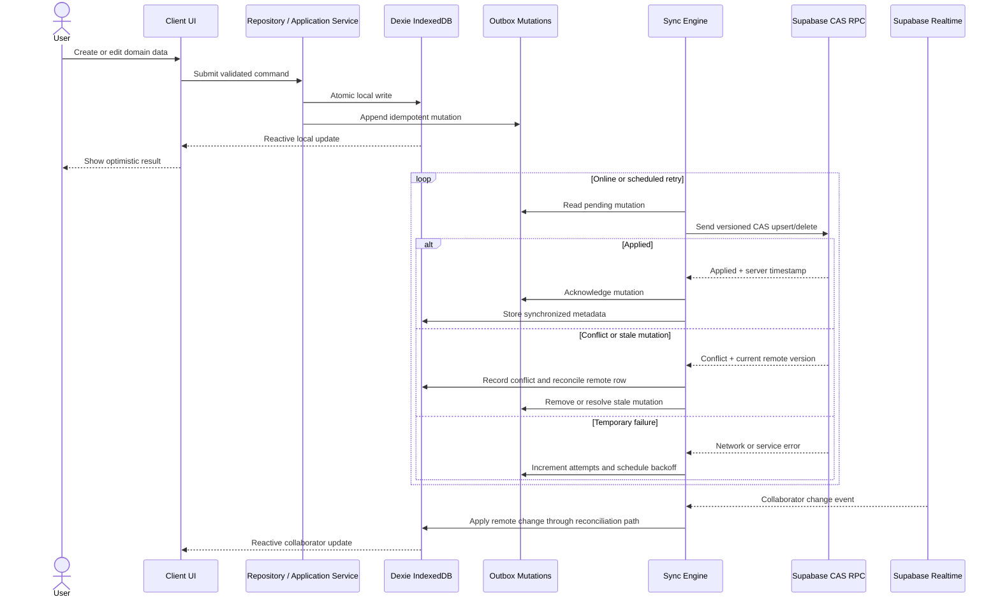

<div align="center">

# Viatik

### Plan together. Stay in sync. Keep traveling—even in airplane mode.

<!-- Replace this placeholder with the final project banner or logo asset. -->


**Viatik is a collaborative, offline-first travel workspace for building itineraries, coordinating travelers, sharing expenses, and keeping essential trip details available on unreliable networks.**

[Get Started](#getting-started) · [Architecture](#architecture-and-data-flow) · [Testing](#testing-strategy)

</div>

## Badges

[](https://nextjs.org/)
[](https://www.typescriptlang.org/)
[](https://tailwindcss.com/)
[](https://supabase.com/)
[](https://playwright.dev/)
[](#license)

## Table of Contents

- [Overview](#overview)
- [Features](#features)
  - [Offline-first resilience](#offline-first-resilience)
  - [Collaboration and itinerary planning](#collaboration-and-itinerary-planning)
  - [Finance and settlements](#finance-and-settlements)
  - [Security and privacy](#security-and-privacy)
- [Architecture and Data Flow](#architecture-and-data-flow)
- [Tech Stack](#tech-stack)
- [Project Structure](#project-structure)
- [Getting Started](#getting-started)
- [Configuration](#configuration)
- [Testing Strategy](#testing-strategy)
- [Development Workflow](#development-workflow)
- [License](#license)

## Overview

Travel coordination should not stop when a phone loses connectivity. Viatik is designed around a local-first model: once a trip is available on a device, the core workspace remains useful while the user is offline. Local changes are applied immediately, queued durably, and synchronized with Supabase when connectivity returns.

The application is built for:

- Groups coordinating multi-day trips.
- Families sharing schedules, travelers, documents, and costs.
- Solo travelers who need reliable access to essential plans.
- Destinations with expensive, intermittent, or unavailable mobile data.

> **Core rule:** Dexie (IndexedDB) is the local domain source of truth. Supabase is the remote synchronization target. UI components never query the remote database directly.

## Features

### Offline-first resilience

- Read synchronized trips, activities, expenses, contacts, travelers, and media from Dexie.
- Apply create, update, and delete operations optimistically before any network request.
- Persist mutations in a durable local outbox so refreshes and browser restarts do not lose work.
- Replay mutations with retry handling, exponential backoff, and failure state.
- Use idempotent client mutation identifiers to prevent duplicate writes.
- Resolve concurrent changes deterministically with timestamp/version-aware Last-Write-Wins compare-and-swap operations.
- Reconcile collaborator changes from Supabase Realtime back into Dexie.
- Surface offline, syncing, pending, conflict, and failed-sync states to users.

### Collaboration and itinerary planning

- Create and manage trips with destinations, dates, budgets, currencies, covers, and traveler counts.
- Invite collaborators with owner, editor, and viewer roles.
- Build day-by-day itineraries with an unscheduled idea backlog.
- Drag and drop activities between days and reorder them with stable rank metadata.
- Use touch-friendly interactions on mobile and accessible alternatives for keyboard users.
- Add locations, dates, times, categories, notes, and costs to activities.
- Manage private contacts and attach named travelers to trips.
- Share trip and activity media with local previews, compression, upload progress, and retry states.
- Keep essential trip assets available for offline use.

### Finance and settlements

- Record shared expenses with payer, participants, currency, description, and split type.
- Support equal, percentage, and exact splits.
- Calculate balances and settlement summaries deterministically.
- Store monetary values as integer minor units to avoid floating-point rounding errors.
- Validate that exact splits reconcile with the source amount and percentage splits total 100%.
- Keep expense changes local-first and synchronize them through the same outbox pipeline.

### Security and privacy

- Passkey/WebAuthn authentication with an OTP fallback through Supabase Auth.
- Secure cookie-based sessions with server-side authentication checks.
- Strict Supabase Row-Level Security for profiles, trips, memberships, expenses, contacts, travelers, and media.
- Owner/editor/viewer authorization enforced at the database boundary, not only in the UI.
- Server-only handling for privileged credentials and third-party API keys.
- Validated destination search through a server action.
- Sanitization and safe rendering boundaries for user-provided content.
- Redacted logging that avoids tokens, secrets, and private trip data.

## Architecture and Data Flow

Viatik uses Clean Architecture with a hexagonal dependency direction. The domain model and repository contracts are independent of storage details. UI code calls application/repository boundaries; it does not import Supabase clients or issue remote database queries.

### Source-of-truth policy

| Layer | Responsibility | Allowed state |
|---|---|---|
| Dexie.js | Local domain persistence and reactive reads | Trips, activities, expenses, memberships, contacts, travelers, media, outbox, sync metadata |
| Zustand | Transient UI state | Open dialogs, filters, drag state, temporary view preferences |
| Itinerary/repository services | Domain mutations and orchestration | Local transaction, optimistic update, outbox append |
| Sync engine | Asynchronous remote synchronization | Retry, replay, conflict resolution, pull, and Realtime reconciliation |
| Supabase | Shared remote persistence and authorization | PostgreSQL, Auth, Storage, Realtime, RLS policies |

### Optimistic mutation and synchronization flow



### Conflict and ordering model

- Every local mutation has a stable mutation ID.
- Records carry update timestamps and synchronization metadata.
- Compare-and-swap operations prevent stale writes from overwriting newer remote records.
- Deletions use soft-delete/tombstone behavior where required for disconnected clients.
- Activity ordering uses stable activity IDs and sortable position metadata rather than array indexes as identity.
- Repeated, delayed, or reordered events are handled through idempotent reconciliation paths.

### Rendering boundaries

Next.js Server Components are used for server-only access, protected route shells, and reduced client JavaScript. Client Components are used when browser APIs, IndexedDB, event handlers, drag interactions, or transient UI state are required. Sensitive server modules should never be imported into client component graphs.

## Tech Stack

| Category | Technology | Role in Viatik |
|---|---|---|
| Web framework | Next.js 16, App Router | Routing, server/client boundaries, server actions, rendering, metadata |
| UI runtime | React 19 | Component model and interactive application UI |
| Language | TypeScript, strict mode | Type-safe domain, services, components, and infrastructure |
| Styling | Tailwind CSS v4 | Utility styling using CSS-first configuration and `@theme` tokens |
| Design system | OKLCH CSS variables, Radix UI | Semantic light/dark tokens, accessible primitives, responsive UI |
| Local persistence | Dexie.js / IndexedDB | Device-local domain source of truth and durable outbox |
| Local reactivity | dexie-react-hooks | Reactive UI updates from local database changes |
| Remote database | Supabase PostgreSQL | Shared persistence, migrations, RPCs, and RLS |
| Authentication | Supabase Auth, WebAuthn/Passkeys, OTP | Secure passwordless authentication and fallback access |
| Remote files | Supabase Storage | Trip covers, avatars, photos, and shared media |
| Collaboration | Supabase Realtime | Remote change events reconciled into Dexie |
| UI state | Zustand | Ephemeral UI-only state; never domain persistence |
| Drag and drop | `@dnd-kit/core`, `@dnd-kit/sortable` | Touch- and keyboard-aware itinerary ordering |
| Animation | Motion | Transform/opacity-only interaction animation |
| Validation | Zod and boundary validation | Runtime input and environment validation |
| Testing | Vitest, Testing Library | Unit, integration, domain, repository, and component tests |
| Browser testing | Playwright | End-to-end and offline browser scenarios |
| Quality | ESLint, Prettier, TypeScript | Static analysis, formatting, and type safety |

## Project Structure

```text
Viatik/
├── .ai/                         # AI development constitution, agents, specs, templates, skills
├── app/                         # Next.js App Router routes and server actions
│   ├── (app)/                   # Authenticated application routes
│   ├── (auth)/                  # Login, registration, and onboarding routes
│   ├── actions/                 # Server-only actions such as auth and destination search
│   ├── globals.css              # Tailwind v4 imports and OKLCH design tokens
│   └── layout.tsx               # Root metadata, fonts, and error boundary
├── components/                  # Shared UI primitives and application shell
│   ├── app-shell/
│   └── ui/
├── features/
│   ├── domain/                  # Pure entities and repository interfaces; no I/O
│   ├── activities/
│   │   ├── components/          # Itinerary board, day columns, cards, calendar
│   │   └── data/                # Dexie activity repository and tests
│   ├── collaboration/           # Member UI and collaboration repository
│   ├── contacts/                # Private contacts and trip traveler workflows
│   ├── expenses/                # Expense UI, repository, split and balance engine
│   ├── media/                   # Local media repository and upload metadata
│   └── trips/                   # Dashboard, workspace, gallery, trip repository
├── lib/
│   ├── db/                      # Dexie schema, database lifecycle, transactions
│   ├── observability/            # Redacted structured logging and diagnostics
│   ├── store/                   # Zustand UI-only state
│   ├── supabase/                # Browser/server/service clients and row mappers
│   └── sync/                    # Outbox, SyncEngine, Realtime, reconciliation
├── supabase/
│   ├── migrations/              # Ordered PostgreSQL schema, RLS, RPC, and triggers
│   └── security-invariants.test.ts
├── e2e/                         # Playwright browser scenarios
├── public/                      # Static images and PWA assets
├── package.json                 # Scripts and dependency boundaries
├── env.mjs                      # Type-safe environment schema
├── next.config.ts               # Next.js configuration
├── playwright.config.ts         # Browser test configuration
└── vitest.config.mjs            # Unit/integration test configuration
```

### Dependency direction

```text
UI components
    ↓
Application/repository interfaces
    ↓
Domain entities and use-case rules
    ↓
Persistence adapters and infrastructure
    ├── Dexie local adapter
    └── Supabase sync adapter
```

> **Boundary rule:** UI components do not query Dexie tables or Supabase directly as their domain API. Domain reads and writes flow through repository/application boundaries. Supabase synchronization remains an infrastructure concern behind the local-first workflow.

## Getting Started

### Prerequisites

Install the following before starting development:

- Node.js 20 or newer.
- pnpm 11 or newer.
- Git.
- Supabase CLI for local PostgreSQL, Auth, Storage, and Realtime development.
- Docker Desktop or another Docker-compatible runtime for `supabase start`.

Verify your tools:

```bash
node --version
pnpm --version
git --version
supabase --version
docker --version
```

### Clone and install

```bash
git clone https://github.com/abimael92/Viatik.git
cd Viatik
pnpm install
```

### Configure environment variables

Create a local environment file from the checked-in example:

```bash
cp .env.example .env.local
```

Fill in the values in `.env.local`. Never commit this file or place service-role credentials in client code. See [Configuration](#configuration) for the required variables.

### Start local Supabase

If the repository has not been initialized for the Supabase CLI on your machine, initialize it once:

```bash
supabase init
```

Start the local Supabase stack:

```bash
supabase start
```

The CLI prints local URLs and development credentials. Use the local API URL and anon key for `NEXT_PUBLIC_SUPABASE_URL` and `NEXT_PUBLIC_SUPABASE_ANON_KEY` in `.env.local`.

To connect the local project to a hosted Supabase project, authenticate and link it with a project reference:

```bash
supabase login
supabase link --project-ref [SUPABASE_PROJECT_REF]
```

Do not use a production service-role key for local development.

### Apply migrations

Apply the ordered SQL migrations to the local database:

```bash
supabase db reset
```

`supabase db reset` recreates the local database and applies all migrations from `supabase/migrations/`. Use it only for local development because it is destructive to the local database.

For a non-destructive migration workflow against a linked project, review the migration first and then use:

```bash
supabase db push
```

### Start Viatik

```bash
pnpm dev
```

Open [http://localhost:3000](http://localhost:3000).

## Configuration

The checked-in [`.env.example`](./.env.example) documents the available variables:

| Variable | Required | Scope | Purpose |
|---|---:|---|---|
| `NEXT_PUBLIC_SUPABASE_URL` | Yes | Browser/server | Supabase project API URL |
| `NEXT_PUBLIC_SUPABASE_ANON_KEY` | Yes | Browser/server | Public Supabase client key, protected by RLS |
| `SUPABASE_SERVICE_ROLE_KEY` | No/local-dependent | Server only | Privileged administrative operations; never expose client-side |
| `NEXT_PUBLIC_WEBAUTHN_RP_ID` | Yes for passkeys | Browser/server | WebAuthn relying-party ID |
| `NEXT_PUBLIC_WEBAUTHN_RP_NAME` | Yes for passkeys | Browser/server | WebAuthn display name |
| `NEXT_PUBLIC_WEBAUTHN_ORIGIN` | Yes for passkeys | Browser/server | Allowed WebAuthn origin |
| `AUTH_SESSION_SECRET` | Yes where configured | Server only | Session signing secret; use a strong local value |
| `SMS_PROVIDER_API_KEY` | Provider-dependent | Server only | Optional direct SMS provider integration |
| `GOOGLE_MAPS_API_KEY` | Optional | Server only | Destination autocomplete through Places API |

Environment validation is centralized in `env.mjs`. Public variables are explicitly prefixed with `NEXT_PUBLIC_`; private variables must remain server-only.

## Testing Strategy

Viatik uses multiple test layers so local-first behavior, domain calculations, authorization rules, and browser resilience are verified independently.

### Unit and integration tests

Run the complete Vitest suite:

```bash
pnpm test
```

The suite covers areas including:

- Expense split and settlement calculations.
- Trip duration and date validation.
- Dexie repository behavior.
- Transactional local writes and outbox creation.
- Sync engine retry and conflict behavior.
- Supabase mapper behavior.
- Authentication and settings components.
- Trip dashboard, itinerary, and gallery interactions.
- Security invariants represented by migration checks.

Run a focused test file while iterating:

```bash
pnpm exec vitest run features/expenses/lib/expense-calculator.test.ts
```

### Playwright offline E2E

Run the browser suite:

```bash
pnpm test:e2e
```

The Playwright configuration starts a development server with placeholder Supabase variables when needed. For production-like offline behavior, build and start the application first:

```bash
pnpm build
pnpm start
```

Then run Playwright against the running server in a separate terminal:

```bash
PLAYWRIGHT_BASE_URL=http://localhost:3000 pnpm test:e2e
```

Offline scenarios should verify that a user can:

1. Load previously synchronized trip data.
2. Disconnect the network.
3. Create or edit local domain data.
4. Refresh without losing the mutation.
5. Reconnect and observe background synchronization.
6. Confirm that duplicate or conflicting writes are handled safely.

### Static and production checks

```bash
pnpm lint
pnpm typecheck
pnpm build
git diff --check
```

A change is not complete until the relevant tests and quality checks pass. See [`.ai/constitution.md`](./.ai/constitution.md), [`.ai/AGENTS.md`](./.ai/AGENTS.md), and [`.ai/QUICKSTART.md`](./.ai/QUICKSTART.md) for the project development protocol.

## Development Workflow

Viatik follows a specification-first, test-driven workflow:

1. Read [`.ai/llms.txt`](./.ai/llms.txt) and [`.ai/constitution.md`](./.ai/constitution.md).
2. Create a feature spec from [`.ai/templates/feature-spec.md`](./.ai/templates/feature-spec.md), or a bug report from [`.ai/templates/bug-report.md`](./.ai/templates/bug-report.md).
3. Review architecture and dependency direction before implementation.
4. Write a failing test first for new behavior or a regression.
5. Implement the smallest correct change using existing abstractions.
6. Run tests, lint, typecheck, build, and applicable browser/security checks.
7. Update the bug ledger and specification when a defect reveals a durable invariant.
8. Review the final diff for scope, secrets, authorization, accessibility, and offline behavior.

### Useful commands

| Command | Purpose |
|---|---|
| `pnpm dev` | Start the Next.js development server |
| `pnpm test` | Run Vitest unit and integration tests |
| `pnpm test:e2e` | Run Playwright browser tests |
| `pnpm lint` | Run ESLint |
| `pnpm typecheck` | Run strict TypeScript checking |
| `pnpm build` | Create a production build |
| `supabase start` | Start the local Supabase stack |
| `supabase db reset` | Recreate local DB and apply migrations |
| `supabase db push` | Push reviewed migrations to a linked project |

## License

Viatik is released under the **MIT License**.

Copyright (c) 2026 Abimael Garcia

Add the standard MIT license text to a root-level `LICENSE` file before publishing a production release.
